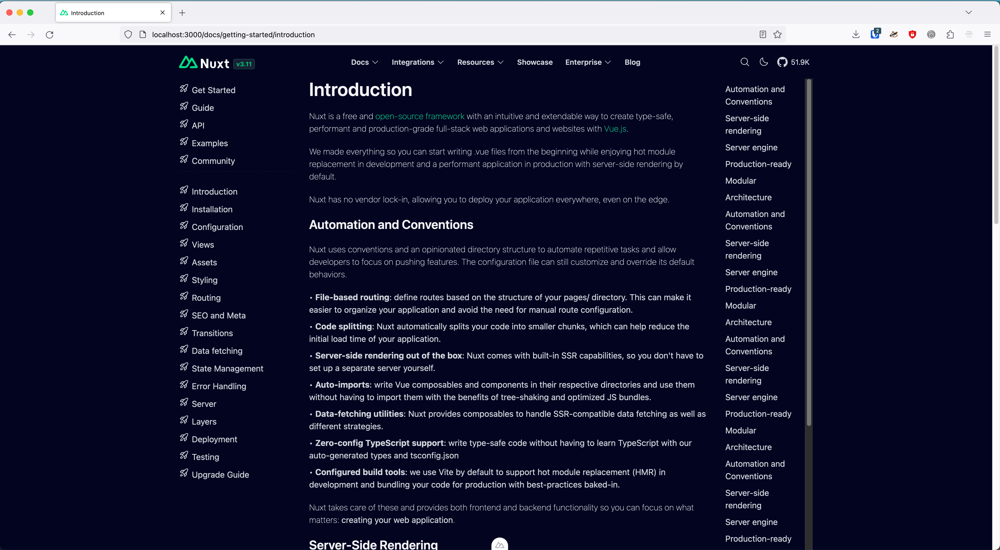

# Nuxt documentation clone

Currently building a clone, using Nuxt & Vue, of Nuxt's [getting started documentation](https://nuxt.com/docs/getting-started/introduction). My purpose is to both brush up on Javascript, HTML & CSS, as well as introduce myself to the Vue and Nuxt frameworks.

I chose this as a starter project because:
1. Cloning something that exists keeps the cognitive load to a minimum, and makes the direction and sense of progress very clear.
2. The site is written in Nuxt & Vue, allowing me to cheat, when necessary, by referencing the browser dev utils and git repo.
3. The site looks like it was designed by someone who cares, so I may pick up some nice UI tricks along the way.
4. It's a simple UI, so it won't be an overwhelming first project.
  
It's still very much a work-in-progress, and the code is trash, but it's been a productive learning experience so far.

---

